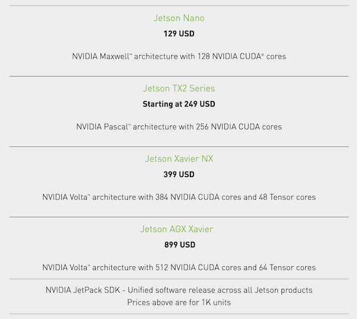
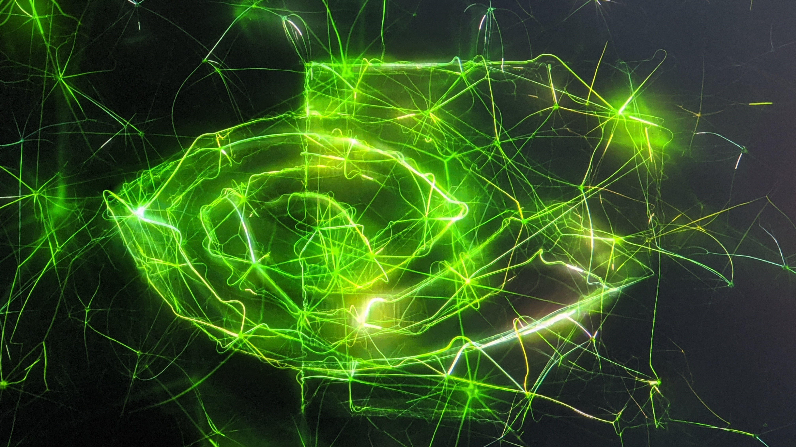

# Computer Vision Starter Pack

> Cheap Nvidia Computer Vision Camera

## Overview

I have recently been toying around with computer vision more. I was looking for a [low cost Nvidia GPU](https://developer.nvidia.com/embedded/jetson-nano-developer-kit) and [camera sensor](https://www.electronicsdatasheets.com/download/5721ed8ce34e24fd697a913a.pdf?format=pdf) to bootstrap some projects. Sure you can started programming inside a [Google Colabnotebook](https://colab.research.google.com/), but I am more interested in embedded systems and [applied machine learning](https://github.com/onnx/models). 

The goal is to start programming real-time camera pipelines, converting state of the art models into TensorRT, and using Nvidia optimized computer vision libraries for things like optical flow and slam! My go to strategy in hardware is always to start small. I want to fully utilize the computing resources before leveling up.



I quick look at the prices and you can see that you actually pay more per cuda core as you up the line. The Jetson Nano and TX2 both aSo, I decided to build out a standard Jetson Nano hardware setup. This guide will go over how to put it all together.


## Materials

0. Nvidia Jetson Nano Developer Kit

1. Sony IMX219 Wide Angle CSI Camera Sensor

2. Samsung (MB-ME128GA/AM) 128GB 100MB/s (U3) MicroSDXC EVO Select Memory Card

3. Adafruit 5V 10A Switching Power Supply

4. Noctua NF-A4x20 5V PWM, Premium Quiet Fan, 4-Pin, 5V Version

5. Geekworm NVIDIA Jetson Nano Metal Case/Enclosure with Power & Reset Control Switch

## Procedure

This is a pretty standard build for Nvidia newcomers like myself. I followed resources available from the developer nvidia documentation and Jetson Hacks helpful vidoes. Here are some links I found helpful:


### 0. Flash and bootup Jetson Nano


Before we get started, make sure you have ordered Jetson Nano Developer Kit, and Samsung Micro SD card. Hopefully you have also have a spare monitor with HDMI port laying around. 

The first step is to flash your SD card with Nvidia Jetpack OS, which is essentially Ubuntu with some extra software and Nvida SDKs that come pre-installed. Plug in the MicroSD card into your day to day computer for the initial flashing.

Follow the [instructions](https://developer.nvidia.com/embedded/learn/get-started-jetson-nano-devkit#write) from the Jetson Nano Get Started guid to write the image to the SD card. It contains references for mac, linux, and windows.

Plugin the flashed SD card into the back of the device, and provide power through the Micro USB port. 



### 1. Internet Connection and SSH

The developer board comes with an ethernet port. Simply hook it up to your router. Keep in mind you may need to relocate your router next to your nano device or get a really long ethernet cable.

```
NETCONF=$(ifconfig)
INETS=$(echo "${NETCONF}" | grep "inet ")
IPADDRS=$(echo "${INETS}" | grep -oE "\b([0-9]{1,3}\.){3}[0-9]{1,3}\b")
LANIP=$(echo "${IPADDRS}" | grep 192 | grep -v 255)
echo "${LANIP}"
```

Run this shell script on your nano device to get the LAN IP address. Then we can connect over ssh to the device. `ssh USERNAME@LANIP`


### 2. Attach Sony IMX219 Camera Sensor

Pretty simple to install camera into one of the two CSI ports on the jetson nano, make sure contact stripts are facing towards the device and secure the clip for stable contact.

Now you can check if the camera is working by capturing a live video stream and displaying. To view display you will need a monitor connected over HDMI.

```
gst-launch-1.0 nvarguscamerasrc sensor_id=0 ! nvoverlaysink
```

Gstreamer is a great tool for handling video feeds. Highly recommend the intro tutorials which uses the C API. Your Jetpack comes with hardware acceleration out of the box. You can 

nvarguscamerasrc is an nvidia tool for automating camera bring up and configurations. It uses tools like libargus an v4l2 under the hood.   

### 3. Fan and Power Supply Setup


### 4. Enclosure and Camera Mount
